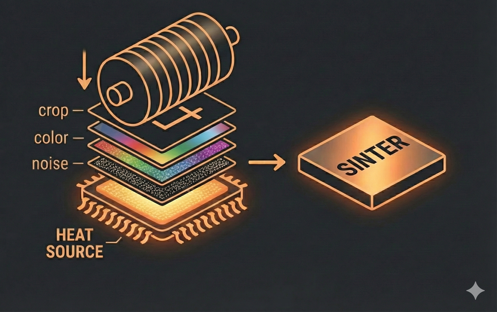

# Sinter

<p align="center">
  
</p>

<p align="center">
  <i>A research prototype exploring compiler-based optimization for image augmentation</i>
</p>

[](LICENSE)
[](https://www.rust-lang.org)

---

*"Surprise! You've built a ~44,000 line research project!"*

**Research prototype. No warranty provided. Not intended for production use. API stability not guaranteed.**

---

## The Core Idea: Compilation, Not Composition

Traditional augmentation libraries compose transforms at runtime:

```python
# Typical library: 4 separate passes through the image
Compose([Brightness(), Contrast(), Gamma(), HorizontalFlip()])
# → pass1 → pass2 → pass3 → pass4
```

Sinter compiles transforms into an optimized execution plan:

```python
# Sinter: analyze pipeline → fuse compatible ops → fewer passes
Compose([Brightness(), Contrast(), Gamma(), HorizontalFlip()])
# → compile → [Fused LUT, HorizontalFlip] → 2 passes

# All photometric? True single pass:
Compose([Brightness(), Contrast(), Gamma()])
# → compile → Fused LUT → 1 pass
```

This is inspired by database query optimizers and JIT compilers: analyze the operations, find optimization opportunities, and execute a fused plan.

---

## Architecture Overview

**Two-phase execution:**

1. **Planning**: Analyze your pipeline, find compatible transforms, fuse them together
2. **Execution**: Run the optimized plan with fewer passes through the image

**Example:**
```python
Compose([Brightness(), Contrast(), Gamma()])
# → Plan: "All 3 are LUT transforms, can fuse"
# → Execute: Single pass with one 256-entry lookup table

Compose([Brightness(), HorizontalFlip(), Contrast()])
# → Plan: "Flip breaks fusion, handle separately"
# → Execute: [Fused LUT, HorizontalFlip] → 2 passes
```

**What gets fused:**

| Transform Type | Fuses With |
|----------------|------------|
| Photometric (LUT) | Other photometric LUT transforms → Single lookup table |
| Photometric (Matrix) | Other matrix transforms → Single 3×3 matrix multiply |
| Geometric (flips/rotates) | Other geometric transforms → Composed transform |
| Mixed | Geometric transforms break photometric fusion (barriers) |

---

## Benchmarks

Benchmark results on **Apple M4** (ARM64), single-threaded, generated with the benchmark
suite in `python/benchmarks/` (min-of-batches; both sides receive the same input — no harness
copy asymmetry). "vs albumentations" tables compare against albumentations 2.0.8; OpenCV
comparisons use cv2 5.0.0 with `setNumThreads(0)`.

### Fair Comparison vs Albumentations (RGB)

**512×512 images**:
| Pipeline | Albumentations | Sinter | Speedup |
|----------|----------------|--------|---------|
| **4 LUT transforms** | 0.45 ms | 0.07 ms | **6.4x** |
| **8 LUT transforms** | 1.11 ms | 0.07 ms | **16.8x** |
| **Mixed Geo + LUT** (Flip, Brightness, Contrast) | 0.235 ms | 0.08 ms | **2.8x** |
| **Heavy pipeline** (14 alb / 17 sinter transforms) | 7.9 ms | 1.7 ms | **4.6x** |

**1024×1024 images** (speedup scales with image size):
| Pipeline | Albumentations | Sinter | Speedup |
|----------|----------------|--------|---------|
| **4 LUT transforms** | 1.73 ms | 0.30 ms | **5.8x** |
| **8 LUT transforms** | 4.30 ms | 0.25 ms | **17.0x** |
| **Mixed Geo + LUT** (Flip, Brightness, Contrast) | 0.906 ms | 0.33 ms | **2.7x** |
| **Heavy pipeline** (14 alb / 17 sinter transforms) | 30.0 ms | 6.9 ms | **4.4x** |

### Notable Architectural Wins

These benchmarks demonstrate specific fusion strategies:

| Strategy | Example | Speedup |
|----------|---------|---------|
| **LUT Fusion** | 8 photometric transforms → single lookup table | **16.8x / 17.0x** (512² / 1024²) |
| **Matrix Fusion** | ToSepia + Saturation → single 3×3 matrix | **5.1x / 3.8x** |
| **Geometric Composition** | FlipH + FlipV → Rot180 via D4 group | **3.0x / 3.8x** |
| **Heavy Pipeline** | 14 transforms with mixed fusion | **4.6x / 4.4x** |

**Why the speedup?**

1. **LUT Fusion**: 8 photometric transforms fuse into a single 256-entry lookup table (one pass)
2. **Geometric Composition**: Transform sequences compose via group theory algebra
3. **Matrix Fusion**: Multiple color matrix ops → single 3×3 matrix multiply
4. **Fewer allocations**: Fused ops avoid intermediate buffers between transforms
5. **NEON SIMD**: Hand-optimized ARM64 intrinsics

**Caveats**:
- ARM64 (Apple Silicon, AWS Graviton) is the primary target with hand-tuned NEON code
- Speedup scales with transform count - more transforms = more fusion opportunities
- Single-threaded comparison; both libraries can use threading for batches
- These tables are **vs albumentations**. Against raw cv2 (single-threaded, matched shapes)
  the picture differs: sinter wins multi-pass/large-kernel Gaussian by 15–69× and most
  LUT/matrix/geometric RGB ops, and is at/near parity on gray Transpose/Rot90 (~0.95×) and
  affine (scale ~1.0×, rotate+scale ~1.25×, rotate+shear ~0.96×). It still trails cv2 on
  single-pass Gaussian 5×5 (~0.8×), gray VerticalFlip (~0.8×), and MedianBlur
  (RGB 0.6–0.8×, gray ~0.4×). See `python/benchmarks/benchmark_gaussian_blur.py` and
  `python/benchmarks/benchmark_geometric_grayscale.py`.

See `python/benchmarks/benchmark_fusion.py` for the fusion benchmark suite.

### Individual Transform Speedups (vs albumentations, RGB)

Sinter includes hand-written NEON intrinsics for ARM64 that provide significant speedups even for single transforms:

| Transform | Speedup (256x256) | Speedup (512x512) | Speedup (1024x1024) | Technique |
|-----------|-------------------|-------------------|---------------------|-----------|
| **Transpose** | **15.3x** | **15.0x** | **6.5x** | 8x8 block tiling with `vtrn1/vtrn2` |
| **AutoContrast** | **9.9x** | **9.1x** | **8.7x** | LUT executor with `vqtbl4q_u8` |
| **HueSaturationValue** | **7.1x** | **7.0x** | **6.9x** | SIMD FP HSV conversion |
| **GaussianBlur(3x3)** | **4.7x** | **5.1x** | **4.9x** | Fused rolling separable `[1,2,1]` |
| **GaussianBlur(5x5)** | **3.4x** | **3.7x** | **4.1x** | Fused rolling separable `[1,4,6,4,1]` |
| **GaussianBlur(7x7)** | **2.3x** | **2.9x** | **3.4x** | Fused rolling separable `[1,6,15,20,15,6,1]` |
| **Sharpen** | **3.0x** | **3.3x** | **3.7x** | 3x3 convolution kernel |
| **Solarize** | **4.0x** | **3.4x** | **3.2x** | LUT executor |
| **ToGray** | **2.7x** | **2.3x** | **2.3x** | RGB luminance formula |
| **Equalize** | **1.7x** | **1.6x** | **1.6x** | LUT executor |

Notes: HSV is the full hue+sat+val variant; the saturation-only comparison is ~1.3×. The
Gaussian technique column reflects the current interleaved fused-ring kernels.

Run individual benchmarks:
```bash
python python/benchmarks/benchmark_individual.py --lut Brightness AutoContrast
python python/benchmarks/benchmark_individual.py Transpose HorizontalFlip
python python/benchmarks/benchmark_individual.py --kernel GaussianBlur Sharpen
```

---

## Sampling & Distributions

**Transforms can use probability distributions.**

Most transforms accept distributions for their parameters:

```python
from sinter import Compose, Brightness, Uniform, Constant, Bernoulli
import numpy as np

# Define a pipeline with distributions
pipeline = Compose([
    Brightness(delta=Uniform(-30.0, 30.0)),  # Random brightness in range
    Contrast(factor=Constant(1.2)),            # Fixed contrast
])
```

**Transforms with probability parameter:**

Some transforms have a `p` parameter that accepts a distribution (default: always applied):

```python
from sinter import CoarseDropout, GaussianBlur

CoarseDropout(holes=8, hole_size=[0.08, 0.08], p=0.7)  # 70% chance
GaussianBlur(kernel_size=5, p=0.5)  # 50% chance
```

**Sample once, reuse many times:**

```python
# Sample the pipeline to get deterministic transforms
sampled = pipeline.sample_with_seed(42)

# Apply to multiple images with the SAME transforms
img1_result = sampled.apply(img1.copy())
img2_result = sampled.apply(img2.copy())
img3_result = sampled.apply(img3.copy())
# All images get the same brightness values

# Or sample fresh for each image
for img in batch:
    result = pipeline.apply(img.copy())  # Different random values each time
```

**Why this matters:**
- **Reproducibility**: Same seed → same transforms across all images
- **Distributed training**: Sample once, send to workers
- **Efficiency**: Avoid re-sampling for every image

**Available distributions:**
- `Uniform(a, b)` - Random value in range [a, b]
- `UniformInt(a, b)` - Random integer in range [a, b]
- `Constant(value)` - Fixed value (deterministic)
- `Bernoulli(p)` - Binary choice with probability p
- `Normal(mean, std)` - Gaussian distribution

---

## Why Rust + NEON?

This prototype is written in Rust to explore:

1. **Zero-cost abstractions**: Can we express transform composition without runtime overhead?
2. **Type-level optimization**: Can the compiler prove fusion safety?
3. **SIMD integration**: Hand-written NEON intrinsics for ARM64 (Apple Silicon, AWS Graviton)

Performance matters: the ~1.6–17× speedup vs traditional libraries comes from both fusion optimizations and hand-tuned NEON code.

---

## Quick Experiment

```python
from sinter import Compose, Brightness, Contrast, Gamma
import numpy as np

# Define a pipeline
pipeline = Compose([
    Brightness(delta=50.0),
    Contrast(factor=0.2),
    Gamma(gamma=1.5),
])

# Apply directly to numpy arrays (safe copy-by-default)
img = np.random.randint(0, 256, (512, 512, 3), dtype=np.uint8)
result = pipeline.apply(img)

# For maximum zero-copy throughput when reusing buffers:
result_fast = pipeline.apply(img, inplace=True)
```

**Memory Semantics**: By default, Sinter uses safe memory semantics (`inplace=False`), so your original image arrays are never modified. To enable zero-copy execution without buffer allocation, pass `inplace=True`.

---

## Installation

**Install from pre-built wheel** (recommended):

```bash
# Download from releases: https://github.com/albu/sinter/releases
pip install sinter-0.1.0-cp311-cp311-macosx_11_0_arm64.whl
```

The only dependency is `numpy>=1.20`. OpenCV is statically linked.

---

## Development

To build from source or contribute, you'll need:

- Rust toolchain (1.75+)
- maturin

```bash
# Install build dependencies
pip install maturin

# Build and install development wheel
# NOTE: prefer the script below. `maturin develop`/`uv pip install` can
# resolve a STALE sinter wheel from the uv cache (this has repeatedly
# replaced the installed extension with an old build that fails ~64 Python
# tests). The script builds fresh, force-installs, and verifies behavior.
./scripts/rebuild_sinter.sh

# Quick check that the installed extension matches the current source
.venv/bin/python scripts/verify_sinter_install.py
```

See [ARCHITECTURE.md](ARCHITECTURE.md) for architectural details and IR design.

---

## Documentation

- **[ARCHITECTURE.md](ARCHITECTURE.md)** - Deep dive into IR design, fusion rules, and optimization
- **[DEVELOPMENT.md](DEVELOPMENT.md)** - How transforms are implemented and extended

---

## Project Status

This is an ongoing research project. Topics I'm exploring:

- [ ] More photometric transform types
- [ ] Visualization of compiled plans

---

## Background

I co-created [Albumentations](https://github.com/albumentations-team/albumentations) ~8 years ago. It became successful, which eventually became exhausting. Sinter is my exploration of whether there's a fundamentally different approach to the problem - not as a replacement, but as a way to explore ideas that didn't fit into the Albumentations architecture.

---

## License

Creative Commons BY-NC-SA 4.0 - See [LICENSE](LICENSE)

**Non-commercial, share-alike**. This is research, not a product.
